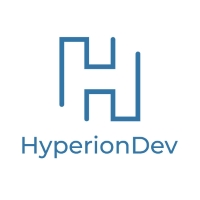

<!--
**hak1979/hak1979** is a ✨ _special_ ✨ repository because its `README.md` (this file) appears on your GitHub profile.

Here are some ideas to get you started:

- 🔭 I’m currently working on ...
- 🌱 I’m currently learning ...
- 👯 I’m looking to collaborate on ...
- 🤔 I’m looking for help with ...
- 💬 Ask me about ...
- 📫 How to reach me: ...
- 😄 Pronouns: ...
- ⚡ Fun fact: ...
-->

## About Me

Physicist, scientist, project manager, teacher, educational technologist and now an aspiring software engineer. I have worn a number of hats already and I look forward to trying on a few more.
 
In my time as a researcher, I have had the opportunity to contribute to the wider science community by inventing new apparatus and publications in journals. As a dynamic person I feel I brought much to the teaching profession as a Science and Mathematics teacher. Technology has always interested me, during my travels in China and South-east Asia, I became involved in some local projects such as setting up a local market-space website. This has inspired me to learn how to program which led me to take online courses by Harvard and Microsoft during my travels. This has lead me to combine my experience in education and technology to consult and work as an educational technologist in Russel Group universities in the UK; where I have lead many projects on creating learning and instructional design, and develop and enhance the use of virtual learning environments. Working on these projects, I have again realised that I really enjoyed the creative side of programming where I was able to bring ideas to life in the digital realm. 

Having had no real formal programming education has lead me to apply for a sponsored Software Engineering Bootcamp at HyperionDev. At HyperionDev the access to mentors and lecturers to get feedback on my code and to be able to discuss and ask questions would greatly help understand my progress. By the end of the bootcamp I hope to be confident in my programming abilities to be able to pursue projects that I was not previously confident in taking on.

&emsp;&emsp;&emsp;&emsp;&emsp;&emsp;&emsp;&emsp; &emsp;&emsp;&emsp;&emsp; &emsp;&emsp;&emsp;&emsp; 
